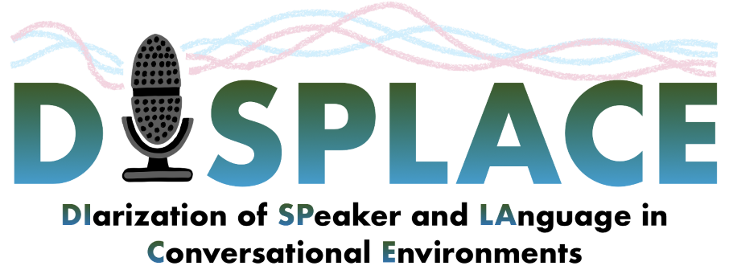

<div align="left"></div>

# About the Challenge
The DISPLACE challenge aims to address research issues related to speaker and language diarization in an inclusive manner. The goal of the challenge is to establish new benchmarks for speaker diarization (SD) in multilingual settings and language diarization (LD) in multi-speaker settings, using the same underlying dataset. 

In this challenge, we provide a conversational dataset for speaker and language diarization task. The unique attritibutes of this dataset are that it consists of multiple speakers speaking in a code mixed meeting environment which makes the mentioned tasks of speaker and langauge diarization challenging. The further details about the challenge can be found at [DISPLACE 2023](https://displace2023.github.io/). 

# Updates
[24/01/2023]: We have released the code to compute the Baseline for speaker diarization. 

The results are computed on development set part 1 and will be updated with more data. 

# Baseline for speaker diarization 
The implementation of the speaker diarization baseline is largely similar to the  [Third DIHARD Speech Diarization Challenge (DIHARD III)](https://dihardchallenge.github.io/dihard3/). 
This baseline has been decribed in DIHARD III baseline paper :
- Ryant, Neville et. al. (2021) “The Third DIHARD Diarization Challenge,” in Proc. INTERSPEECH, 2021. ([paper](https://www.isca-speech.org/archive/interspeech_2021/ryant21_interspeech.html))

The steps involve speech activity detection, front-end feature extraction, x-vector extraction, PLDA scoring followed by Agglomerative Hierarchical Clustering (AHC). The resegmentation is applied to refine speaker assignment using [VB-HMM](https://www.fit.vutbr.cz/research/groups/speech/publi/2018/diez_odyssey2018_63.pdf). 

X-vector extractor is a 13-layer TDNN model which follows the BIG DNN architecture from Zeinali et. al., 2019 ([paper](https://arxiv.org/pdf/1910.12592.pdf)).

The x-vector extractor, PLDA model, UBM-GMM, and total variability matrix were trained on [VoxCeleb I and II](https://www.robots.ox.ac.uk/~vgg/data/voxceleb/). Prior to PLDA scoring and clustering, the x-vectors are centered and whitened using statistics estimated from the DISPLACE development set part 1.

# Prerequisites

The following packages are required to run the baseline.

- [Python](https://www.python.org/) >= 3.7
- [Kaldi](https://github.com/kaldi-asr/kaldi)
- [dscore](https://github.com/nryant/dscore)

The data should be arranged for the baseline experiments should be as follows:  
```
   
───<DEV/EVAL data dir>
    │
    └─── data
         |
         └─── rttm 
         |        |
         |        └───<<Session_ID>_speaker.rttm>
         │ 
         └─── wav
                 └───<<Session_ID>.wav>
                 
```
We request the participants to arrange the shared DEV and EVAL sets in the above format for baseline computation.
- The directory "rttm" should contain the rttm files corresponding to speaker splits.
- The directory "wav" should contain the corresponding wav files.
- The corresponding files in the directories are indicated by the <Session_ID>

# Installation
  
## Step 1: Clone the repo and create a new virtual environment

Clone the repo:

```bash
git clone https://github.com/displace2023/Baseline.git
cd Baseline
```

While not required, we recommend running the recipes from a fresh virtual environment. If using ``virtualenv``:

```bash
virtualenv venv
source venv/bin/activate
```

Alternately, you could use ``conda`` or ``pipenv``. Make sure to activate the environment before proceeding.


## Step 2: Installing Python dependencies

Run the following command to install the required Python packages:

```bash
pip install -r requirements/core.txt
```

```bash
pip install -r requirements/sad.txt
```


## Step 3: Installing remaining dependencies

We also need to install [Kaldi](https://github.com/kaldi-asr/kaldi) and [dscore](https://github.com/nryant/dscore). To do so, run the the installation scripts in the ``tools/`` directory:

```bash
cd tools
./install_kaldi.sh
./install_dscore.sh
cd ..
```

Please check the output of these scripts to ensure that installation has succeeded. If succesful, you should see ``Successfully installed {Kaldi,dscore}.`` printed at the end. If installation of a component fails, please consult the output of the relevant installation script for additional details. If you already have the packages installed creating a softlink to the packages also works.
  
# Running the baseline recipes
Change the path to
```bash
cd speaker_diarization/
```

# Dataset path
open ``run.sh`` in a text editor. The first section of this script defines paths to the Displace challenge DEV and EVAL releases and should look something like the following:

```bash
################################################################################
# Paths to Displace releases
################################################################################

DISPLACE_DEV_DIR=/data1/kaustubhk/Displace_DEV_1
DISPLACE_EVAL_DIR=/data1/kaustubhk/Displace_EVAL_1
  
Change the variables ``DISPLACE_DEV_DIR`` and ``DISPLACE_DEV_DIR`` so that they point to the roots of the Displace DEV and EVAL releases on your filesystem. Save your changes, exit the editor, and run:

```bash
./run.sh
```
  
### RTTM files

Following the initial AHC segmentation step, RTTM files for the DEV set are written to:

    exp/displace_diarization_nnet_1a_dev_fbank/per_file_rttm
  
Similarly, RTTM files for the EVAL set are written to:

    exp/displace_diarization_nnet_1a_eval_fbank/per_file_rttm

RTTM files will also be output after the VB-HMM resegmentation step, this time to:

- ``exp/displace_diarization_nnet_1a_vbhmm_dev/per_file_rttm``
- ``exp/displace_diarization_nnet_1a_vbhmm_eval/per_file_rttm``
  
### Scoring

The performance is evaluated using [Diaration error rate (DER)](https://github.com/nryant/dscore) as the primary metric.

DER = False Alarm speech + Missed Speech + Speaker Confusion error

- speaker error -- percentage of scored time for which the wrong speaker id is assigned within a speech region
- false alarm speech -- percentage of scored time for which a nonspeech region is incorrectly marked as containing speech
- missed speech -- percentage of scored time for which a speech region is incorrectly marked as not containing speech

DER on the DEV set for the output of the AHC step will be printed to STDOUT
These scores are extracted from the original ``dscore`` logs, which are output to ``exp/displace_diarization_nnet_1a_dev_fbank/scoring``
Similarly, the scores for the VB-HMM are output to ``exp/displace_diarization_nnet_1a_vbhmm_dev/scoring`` 
  
# Expected results

Expected DER for the baseline system on the Displace challenge DEV set are presented in Table 1.


**Table 1: Baseline speaker diarization results for the Displace development set(part 1) using just AHC and AHC followed by VB-HMM resegmentation.**

|  Method       | DER (Dev)   | 
| ------------  | ----------- |
| AHC           |   28.81     |       
| VB-HMM        |   27.7      |
  

  
<!-- ## Pretrained SAD model

We have placed a copy of the TDNN+stats SAD model used to produce these results on [Zenodo](https://zenodo.org/). To use this model, download and unarchive the [tarball](https://zenodo.org/record/4299009), then move it to ``speaker_diarization/exp``. -->

  


